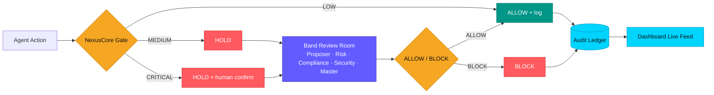

# NexusCore

```text
███╗   ██╗███████╗██╗  ██╗██╗   ██╗███████╗ ██████╗ ██████╗ ██████╗ ███████╗
████╗  ██║██╔════╝╚██╗██╔╝██║   ██║██╔════╝██╔════╝██╔═══██╗██╔══██╗██╔════╝
██╔██╗ ██║█████╗   ╚███╔╝ ██║   ██║███████╗██║     ██║   ██║██████╔╝█████╗
██║╚██╗██║██╔══╝   ██╔██╗ ██║   ██║╚════██║██║     ██║   ██║██╔══██╗██╔══╝
██║ ╚████║███████╗██╔╝ ██╗╚██████╔╝███████║╚██████╗╚██████╔╝██║  ██║███████╗
╚═╝  ╚═══╝╚══════╝╚═╝  ╚═╝ ╚═════╝ ╚══════╝ ╚═════╝ ╚═════╝ ╚═╝  ╚═╝╚══════╝
```

Before an AI agent acts, NexusCore makes it answer.


NexusCore sits above agent workflows and asks a simple question before risky work
happens: should this action be allowed, blocked, or held for human confirmation?

This is a **hackathon project built for Band of Agents by lablab.ai**. It uses
Band as the collaboration room where multiple specialized agents review risky
actions together, while the NexusCore dashboard shows the decision process, risk
tier, emergency brake state, and audit trail.

## Team

**Team Name:** Vizminds

| Member | Role |
| --- | --- |
| Ayna Khan | Team Lead |
| Syuja Dewa | Team Member |
| Muneeb Ahmed Khan | Team Member |
| Abdullah | Team Member |
| Mehmood Ahmed Khan | Team Member |

## Problem Statement

AI agents are becoming powerful enough to write code, deploy services, modify
infrastructure, access secrets, and run database commands. That speed is useful,
but it creates a serious governance gap: most agent systems do not have a clear
"control tower" that can stop dangerous actions before they happen.

For example, an agent might try to:

- Run a destructive database command.
- Deploy directly to production.
- Delete files or cloud resources.
- Expose secrets.
- Change authentication or permissions without review.

In normal software teams, humans use approvals, incident reviews, logs, and
change-management policies. Agent teams need the same kind of governance layer,
but built for autonomous multi-agent workflows.

## Hackathon Pitch

**NexusCore is the emergency brake and audit brain for AI agent teams.**

Instead of allowing agents to execute risky work directly, NexusCore intercepts
the proposed action, classifies the risk, sends it to a Band-powered team of
review agents, and requires a clear allow/block decision before the action can
continue.

The one-line pitch:

```text
NexusCore lets AI agents move fast without letting them move dangerously.
```

## Our Solution

NexusCore combines a governance API, a live dashboard, and a Band multi-agent
review room.

The system provides:

- A `LOW`, `MEDIUM`, and `CRITICAL` risk-tier engine.
- A safe runtime interceptor wrapper for commands and actions.
- Human confirmation for critical actions.
- A Band room where specialized agents review the action together.
- A dashboard that shows workflow progress, pending approvals, and audit logs.
- A ledger that records whether actions were allowed, blocked, or held.

The current interceptor is intentionally demo-safe: it proves the
"before execution" governance pattern without actually running destructive
commands.

## How It Works

1. A user launches a workflow or proposes an action.
2. NexusCore classifies the action as `LOW`, `MEDIUM`, or `CRITICAL`.
3. Low-risk actions can pass automatically.
4. Medium-risk actions are held for review.
5. Critical actions are held and require explicit human confirmation.
6. Band agents review the action in a shared room.
7. The final allow/block result is written into the audit ledger.

## Tech Stack

| Layer | Technology |
| --- | --- |
| Frontend | React, TypeScript, Vite |
| UI | Tailwind CSS, Radix UI, MUI icons, Lucide icons |
| Backend | Python, FastAPI, Pydantic |
| Realtime Updates | FastAPI WebSockets |
| Agent Collaboration | Band SDK, Band remote agents |
| Agent Adapter | LangGraph adapter through Band |
| LLM Providers | AI/ML API, Featherless |
| Models | GPT-4o, GPT-4o-mini, Qwen2.5-72B |
| Deployment | Render-compatible Python service |

## Architecture



## What Is Needed

To run the full project locally, you need:

- Python 3.10+.
- Node.js and npm.
- A Band account and remote agent credentials.
- AI/ML API key for GPT-based agents.
- Featherless API key for the Qwen risk agent.
- Local env files created from the provided examples.

For backend-only testing, you can run without live Band agents by setting:

```text
RUN_AGENTS=0
```

## Repository Structure

```text
NexusCore/
|-- backend/      FastAPI governance API, WebSocket feed, risk engine, audit log
|-- frontend/     React/Vite dashboard for workflows, agents, governance, ledger
|-- agents/       Band remote agents for multi-agent review and decision support
|-- start.py      Unified local/Render launcher for backend plus configured agents
|-- render.yaml   Render deployment config
```

## Dashboard Tabs

| Tab | Purpose |
| --- | --- |
| Dashboard | Main workflow view. Launches feature/action reviews and shows live agent progress. |
| Features | Tracks feature requests and execution state. |
| Agents | Shows the active agent team, roles, models, and operating status. |
| Architecture | Explains the NexusCore governance architecture and collaboration flow. |
| Security | Shows security posture, risk signals, and demo safety controls. |
| Governance | Main emergency brake page with runtime interceptor, pending approvals, and audit ledger. |
| Analytics | Demo metrics for agent decisions, governance trends, and risk activity. |
| Settings | Demo configuration controls for governance behavior and integrations. |

## Agent Team

NexusCore supports a nine-agent review architecture. The first four agents are
the core MVP path; the others add stronger hackathon-demo coverage.

| Agent | File | Main Function | Model / Provider |
| --- | --- | --- | --- |
| Master Agent | `agents/master_agent.py` | Final coordinator. Produces the final allow/block decision after review. | GPT-4o / AI/ML API |
| Proposer Agent | `agents/proposer_agent.py` | Converts a request or risky command into a structured proposal. | GPT-4o / AI/ML API |
| Risk Agent | `agents/risk_agent.py` | Assesses blast radius, reversibility, data loss, and production impact. | Qwen2.5-72B / Featherless |
| Compliance Agent | `agents/compliance_agent.py` | Checks policy, approval, audit, and governance requirements. | GPT-4o-mini / AI/ML API |
| Engineer Agent | `agents/engineer_agent.py` | Reviews implementation plan, code path, and technical feasibility. | GPT-4o / AI/ML API |
| Security Agent | `agents/security_agent.py` | Looks for auth, permission, secret, endpoint, and vulnerability risks. | GPT-4o-mini / AI/ML API |
| Test Agent | `agents/test_agent.py` | Checks test coverage, validation plan, and failure scenarios. | GPT-4o-mini / AI/ML API |
| Infrastructure Agent | `agents/infrastructure_agent.py` | Reviews deploy, database, cloud, CI/CD, and production impact. | GPT-4o-mini / AI/ML API |
| Rollback/Audit Agent | `agents/rollback_audit_agent.py` | Checks rollback plan, backups, traceability, and audit readiness. | GPT-4o-mini / AI/ML API |

## How Band Is Used

Band is the collaboration layer. NexusCore triggers a review, the configured
remote agents join the Band room, and their messages are mirrored back into the
dashboard.

Relevant backend endpoints:

| Endpoint | Purpose |
| --- | --- |
| `GET /api/band/status` | Shows whether Band integration is configured. |
| `POST /api/band/trigger` | Launches a workflow review in the Band room. |
| `GET /api/band/room` | Returns the active Band room. |
| `GET /api/band/messages` | Pulls recent Band messages into the dashboard. |
| `GET /ws` | Live WebSocket feed for dashboard updates. |

## Risk Tiers and Emergency Brake

The backend includes a rule-based risk classifier.

| Tier | Behavior | Example |
| --- | --- | --- |
| `LOW` | Automatically allowed and logged. | `GET /api/orders/health` |
| `MEDIUM` | Held for review. | `deploy staging notifications-service` |
| `CRITICAL` | Held and cannot be allowed without human confirmation. | `DROP TABLE payment_transactions` |

Critical indicators include destructive database operations, production deploys,
secret exposure, bulk deletion, privilege changes, and commands like `rm -rf`.

Main governance endpoints:

| Endpoint | Purpose |
| --- | --- |
| `POST /api/actions/propose` | Creates a proposed action for governance review. |
| `POST /api/interceptor/commands` | Safe demo interceptor that classifies a command before execution. |
| `GET /api/actions` | Returns the audit/action ledger. |
| `POST /api/actions/{id}/decide` | Allows or blocks a held action. Critical allows require `human_confirmed=true`. |

## Local Setup

### 1. Python Environment

From the project root:

```powershell
python -m venv .venv
.\.venv\Scripts\activate
pip install -r requirements.txt
```

### 2. Backend Environment

Create local env files from the examples:

```powershell
Copy-Item backend\.env.example backend\.env
Copy-Item agents\agent_config.example.yaml agents\agent_config.yaml
```

Fill in your own keys in the local files only. Do not commit real secrets.

Important variables:

```text
AIML_API_KEY=...
FEATHERLESS_API_KEY=...
BAND_ROOM=...
BAND_MASTER_UUID=...
BAND_MASTER_KEY=...
BAND_RISK_UUID=...
BAND_RISK_KEY=...
BAND_COMPLIANCE_UUID=...
BAND_COMPLIANCE_KEY=...
BAND_PROPOSER_UUID=...
BAND_PROPOSER_KEY=...
```

Optional expanded agent variables:

```text
BAND_ENGINEER_UUID=...
BAND_ENGINEER_KEY=...
BAND_SECURITY_UUID=...
BAND_SECURITY_KEY=...
BAND_TEST_UUID=...
BAND_TEST_KEY=...
BAND_INFRASTRUCTURE_UUID=...
BAND_INFRASTRUCTURE_KEY=...
BAND_ROLLBACK_AUDIT_UUID=...
BAND_ROLLBACK_AUDIT_KEY=...
```

Set `RUN_AGENTS=0` if you want to run only the backend without launching Band
agent subprocesses.

### 3. Start Backend and Agents

From the project root:

```powershell
.\.venv\Scripts\python.exe start.py
```

The backend runs on:

```text
http://localhost:8000
```

Health checks:

```text
http://localhost:8000/api/health
http://localhost:8000/api/band/status
```

### 4. Start Frontend

In a second terminal:

```powershell
cd frontend
npm install
npm run dev -- --host 0.0.0.0
```

Open:

```text
http://localhost:5173
```

## Production Preview

To serve the built frontend through FastAPI:

```powershell
cd frontend
npm install
npm run build
cd ..
.\.venv\Scripts\python.exe start.py
```

Then open:

```text
http://localhost:8000
```

## Demo Test Scenarios

### Scenario 1: Normal Multi-Agent Workflow

Use the dashboard workflow launcher:

```text
Build role-based access control for admin and support users with audit logging.
```

Show:

- Dashboard workflow progress.
- Band room side by side, showing agents responding.
- Agents tab, explaining the team roles.
- Governance tab, showing any resulting ledger entries.

### Scenario 2: Medium-Risk Held Action

Use the Governance runtime interceptor:

```text
deploy staging notifications-service
```

Expected result:

- Risk tier: `MEDIUM`
- Status: `HELD`
- Action appears in pending approvals.
- Allow/block decision writes to the audit ledger.

### Scenario 3: Critical Emergency Brake

Use the Governance runtime interceptor:

```text
DROP TABLE payment_transactions
```

Expected result:

- Risk tier: `CRITICAL`
- Status: `HELD`
- Dashboard requires human confirmation before allow.
- Blocking or confirmed allow is written to the audit ledger.

### Scenario 4: Low-Risk Auto Allow

Use the Governance runtime interceptor:

```text
GET /api/orders/health
```

Expected result:

- Risk tier: `LOW`
- Status: `ALLOWED`
- No approval required.
- Audit ledger records the action.

## API Test Examples

PowerShell examples:

```powershell
Invoke-RestMethod -Method Post `
  -Uri http://localhost:8000/api/interceptor/commands `
  -ContentType "application/json" `
  -Body '{"command":"GET /api/orders/health","agent":"Demo Operator"}'
```

```powershell
Invoke-RestMethod -Method Post `
  -Uri http://localhost:8000/api/interceptor/commands `
  -ContentType "application/json" `
  -Body '{"command":"DROP TABLE payment_transactions","agent":"Demo Operator"}'
```

For critical actions, allowing without human confirmation should fail:

```powershell
Invoke-RestMethod -Method Post `
  -Uri http://localhost:8000/api/actions/{ACTION_ID}/decide `
  -ContentType "application/json" `
  -Body '{"decision":"ALLOW"}'
```

Allowing with confirmation should pass:

```powershell
Invoke-RestMethod -Method Post `
  -Uri http://localhost:8000/api/actions/{ACTION_ID}/decide `
  -ContentType "application/json" `
  -Body '{"decision":"ALLOW","human_confirmed":true}'
```

## Security Notes

- Never commit `.env`, `env`, or `agents/agent_config.yaml`.
- Use `backend/.env.example` and `agents/agent_config.example.yaml` as templates.
- If a real key was ever pasted into a file or chat, rotate it before demo or
  deployment.
- The runtime interceptor is intentionally safe for the hackathon demo: it
  proves pre-execution governance without executing real destructive commands.

## Current Status

Implemented:

- FastAPI governance backend
- React/Vite dashboard
- Band room trigger and message mirror
- Nine-agent Band architecture
- Risk-tier classifier: `LOW`, `MEDIUM`, `CRITICAL`
- Critical human confirmation enforcement
- Safe runtime interceptor wrapper
- Pending approvals and audit ledger
- Local and Render-compatible launcher

Known limitations:

- The interceptor is a demo wrapper, not a system-wide shell or database proxy.
- Some dashboard tabs include demo analytics/configuration data for storytelling.
- The audit ledger is in-memory for the running backend process.
- Agent names in the dashboard/story may be slightly simplified, but they map to
  the implemented agent roles above.
